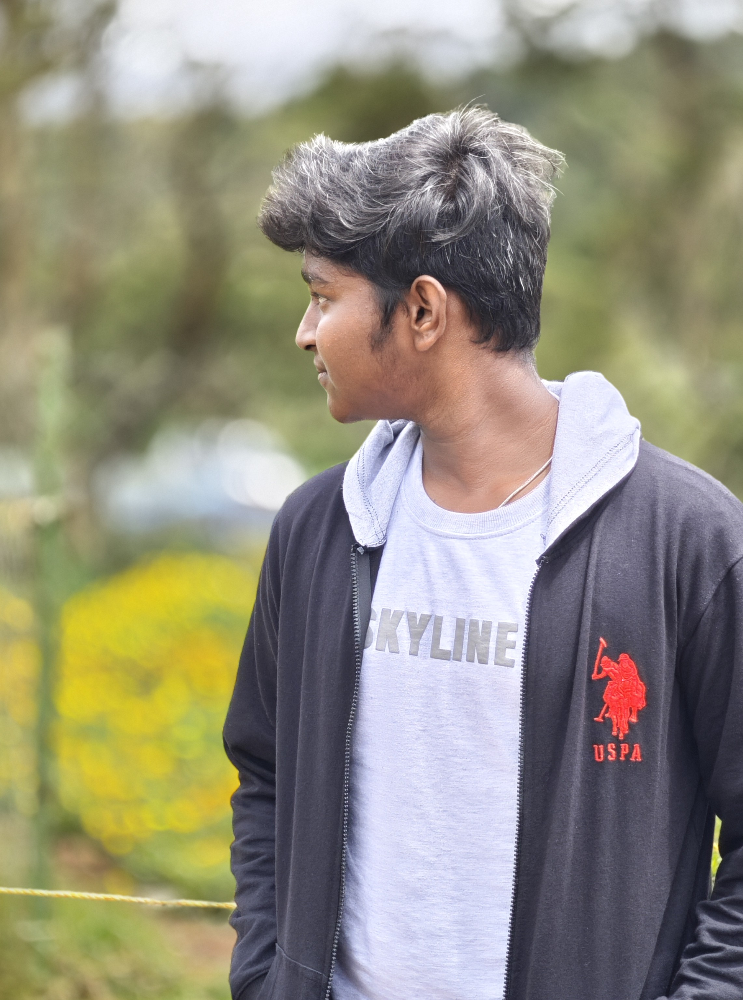

<h2><strong>ABOUT ME</strong></h2>

<table>
<tr>
<td width="31%" align="center" valign="middle">

<b>DEVAVARDHAN M I</b> 
Cyber Security · SKCET 
Coimbatore, Tamil Nadu, India

</td>
<td width="69%" valign="middle">

### Building practical software with a security-first mindset.

I'm a **Cyber Security student and developer** focused on building practical solutions across **full-stack development, artificial intelligence, computer vision, cybersecurity and blockchain**.

I enjoy working across the complete engineering cycle — from **UI and API design** to **databases, system architecture, testing and security**.

| Focus Area | What I Work On |
|:---|:---|
| 💻 **Full-Stack** | Web applications · REST APIs · Databases · System architecture |
| 🤖 **AI & Vision** | AI applications · Computer vision · Automation |
| 🔐 **Cybersecurity** | Secure application design · Identity & access · Security-focused systems |
| ⛓️ **Blockchain** | Smart contracts · Digital identity · Web3 applications |

**Engineering mindset:** Understand → Design → Build → Test → Secure → Improve

</td>
</tr>
</table>

---

## Skills & Tools

<table>
<tr>
<td align="center" width="10%"> <b>C</b></td>
<td align="center" width="10%"> <b>Java</b></td>
<td align="center" width="10%"> <b>Python</b></td>
<td align="center" width="10%"> <b>JavaScript</b></td>
<td align="center" width="10%"> <b>TypeScript</b></td>
<td align="center" width="10%"> <b>HTML5</b></td>
<td align="center" width="10%"> <b>CSS3</b></td>
<td align="center" width="10%"> <b>React</b></td>
<td align="center" width="10%"> <b>Next.js</b></td>
<td align="center" width="10%"> <b>Vite</b></td>
</tr>

<tr>
<td align="center"> <b>Node.js</b></td>
<td align="center"> <b>Express</b></td>
<td align="center"> <b>Spring Boot</b></td>
<td align="center"> <b>FastAPI</b></td>
<td align="center"> <b>Tailwind</b></td>
<td align="center"> <b>Bootstrap</b></td>
<td align="center"> <b>PostgreSQL</b></td>
<td align="center"> <b>MySQL</b></td>
<td align="center"> <b>MongoDB</b></td>
<td align="center"> <b>Redis</b></td>
</tr>

<tr>
<td align="center"> <b>Docker</b></td>
<td align="center"> <b>Git</b></td>
<td align="center"> <b>GitHub</b></td>
<td align="center"> <b>VS Code</b></td>
<td align="center"> <b>Postman</b></td>
<td align="center"> <b>Firebase</b></td>
<td align="center"> <b>Vercel</b></td>
<td align="center"> <b>OpenCV</b></td>
<td align="center"> <b>PyTorch</b></td>
<td align="center"> <b>Solidity</b></td>
</tr>

<tr>
<td align="center"> <b>Ethereum</b></td>
<td align="center"> <b>Linux</b></td>
<td align="center"> <b>Nginx</b></td>
<td align="center"> <b>Figma</b></td>
<td align="center"> <b>Notion</b></td>
<td align="center"> <b>Arduino</b></td>
<td align="center"> <b>npm</b></td>
<td align="center"> <b>GitHub Actions</b></td>
<td align="center"> <b>Flask</b></td>
<td align="center"> <b>Django</b></td>
</tr>
</table>

---

## Soft Skills

<table>
<tr>
<td align="center" width="20%"> 💬  <b>Clear Communication</b> Explain ideas clearly  </td>
<td align="center" width="20%"> 🤝  <b>Team Collaboration</b> Build with others  </td>
<td align="center" width="20%"> 🧠  <b>Problem Solving</b> Break down complex tasks  </td>
<td align="center" width="20%"> 🎯  <b>Ownership</b> Take responsibility  </td>
<td align="center" width="20%"> 💡  <b>Innovation</b> Explore better approaches  </td>
</tr>

<tr>
<td align="center"> 🔍  <b>Attention to Detail</b> Quality-focused work  </td>
<td align="center"> 📚  <b>Continuous Learning</b> Keep improving  </td>
<td align="center"> ⏱️  <b>Time Management</b> Prioritize effectively  </td>
<td align="center"> 🛠️  <b>Adaptability</b> Learn new tools quickly  </td>
<td align="center"> 🔐  <b>Security Mindset</b> Think beyond functionality  </td>
</tr>

<tr>
<td align="center"> 📝  <b>Documentation</b> Make systems understandable  </td>
<td align="center"> 🧪  <b>Testing Mindset</b> Validate before shipping  </td>
<td align="center"> 🎨  <b>Creative Thinking</b> Turn ideas into solutions  </td>
<td align="center"> 🚀  <b>Execution</b> Move from idea to product  </td>
<td align="center"> 🌱  <b>Growth Mindset</b> Learn from every project  </td>
</tr>
</table>

---

## Featured Projects

<table>
<tr>

<td width="33.33%" valign="top">

### 🔐 SecureChain

**Decentralized identity and access-control platform** combining blockchain, role-based permissions, digital asset ownership and audit trails.

<a href="https://github.com/deva18-ai/SecureChain">View Project →</a>

</td>

<td width="33.33%" valign="top">

### 🛡️ HoneyPot

**Cybersecurity deception platform** focused on capturing suspicious activity, monitoring events and supporting threat investigation.

<a href="https://github.com/deva18-ai/Honeytrap">View Project →</a>

</td>

<td width="33.33%" valign="top">

### 🚦 AI Traffic Analyser

**Computer-vision traffic analysis system** designed to detect vehicles, process traffic data and present useful insights.

<a href="https://github.com/deva18-ai/AI-Traffic-Analyser-Full-Stack">View Project →</a>

</td>

</tr>

<tr>

<td width="33.33%" valign="top">

### 🏙️ Smart City

**Full-stack urban technology platform** exploring software-driven solutions for smart-city workflows and services.

<a href="https://github.com/deva18-ai/Smart-City-Project">View Project →</a>

</td>

<td width="33.33%" valign="top">

### 🏥 AI Healthcare

**Healthcare-focused application** exploring intelligent workflows, risk-oriented analysis and responsive user experiences.

<a href="https://github.com/deva18-ai/AI-Healthcare">View Project →</a>

</td>

<td width="33.33%" valign="top">

### 🔒 Vaultcore

**Security-focused software project** exploring protected data handling, modular architecture and maintainable application design.

<a href="https://github.com/deva18-ai/Vaultcore">View Project →</a>

</td>

</tr>
</table>

## GitHub Dashboard

<table>
<tr>
<td align="center" width="33%">

</td>
<td align="center" width="33%">

</td>
<td align="center" width="33%">

</td>
</tr>
</table>

<table>
<tr>

<td align="center" width="25%" valign="middle">

### 💻
**BUILD**

Full-Stack Applications

</td>

<td align="center" width="25%" valign="middle">

### 🤖
**EXPLORE**

AI & Computer Vision

</td>

<td align="center" width="25%" valign="middle">

### 🔐
**SECURE**

Cybersecurity & Identity

</td>

<td align="center" width="25%" valign="middle">

### ⛓️
**EXPERIMENT**

Blockchain & Web3

</td>

</tr>
</table>

### Development Activity

<table>
<tr>
<td align="center" width="50%">

</td>
<td align="center" width="50%">

</td>
</tr>
</table>

## Current Focus

<table>
<tr>

<td align="center" width="20%" valign="top">

### 🔐

**CYBERSECURITY**

Secure systems Identity & access Threat awareness

</td>

<td align="center" width="20%" valign="top">

### 🤖

**ARTIFICIAL INTELLIGENCE**

AI applications Computer vision Intelligent automation

</td>

<td align="center" width="20%" valign="top">

### 💻

**FULL-STACK ENGINEERING**

Modern interfaces APIs & databases System architecture

</td>

<td align="center" width="20%" valign="top">

### ⛓️

**BLOCKCHAIN**

Smart contracts Digital identity Web3 systems

</td>

<td align="center" width="20%" valign="top">

### 🏆

**HACKATHONS**

Rapid prototyping Team building Real-world problems

</td>

</tr>
</table>

<table>
<tr>
<td align="center" width="33%">

**LEARN**

Explore technologies, patterns and tools.

</td>
<td align="center" width="33%">

**BUILD**

Turn ideas into working prototypes.

</td>
<td align="center" width="33%">

**IMPROVE**

Test, secure and refine every iteration.

</td>
</tr>
</table>

## Profile Summary

  
<strong>GitHub Contribution Activity</strong>
 
Building • Learning • Contributing • Improving

---

# Coding Profiles

<table>
<tr>
<td align="center" width="33.33%" valign="middle">

 
<strong>LeetCode</strong>

 

</td>
<td align="center" width="33.33%" valign="middle">

 
<strong>HackerRank</strong>

 

</td>
<td align="center" width="33.33%" valign="middle">

 
<strong>HackerEarth</strong>

 

</td>
</tr>
</table>

---

# Let's Connect

<table>
<tr>
<td align="center" width="25%"> <strong>GitHub</strong> Projects & Code</td>
<td align="center" width="25%"> <strong>LinkedIn</strong> Professional Network</td>
<td align="center" width="25%"> <strong>Email</strong> Let's Collaborate</td>
<td align="center" width="25%"> <strong>Instagram</strong> Creative Updates</td>
</tr>
</table>

---

💖 Built with love by **Devavardhan M I** &nbsp; • &nbsp; **⚡ Always open for collaborations**

